<picture><source media="(prefers-color-scheme: dark)" srcset="assets/dark/header.svg"/></picture>

<a href="https://laap.top"><picture><source media="(prefers-color-scheme: dark)" srcset="https://img.shields.io/badge/PORTFOLIO-0d1117?style=flat-square&logoColor=ffffff"/></picture></a>
<a href="mailto:vovxb@vovxb.eu"><picture><source media="(prefers-color-scheme: dark)" srcset="https://img.shields.io/badge/EMAIL-0d1117?style=flat-square&logo=gmail&logoColor=ffffff"/></picture></a>
<a href="https://x.com/_yashghule"><picture><source media="(prefers-color-scheme: dark)" srcset="https://img.shields.io/badge/X-0d1117?style=flat-square&logo=x&logoColor=ffffff"/></picture></a>
<a href="https://linkedin.com/in/yash-ghule-463892265"><picture><source media="(prefers-color-scheme: dark)" srcset="https://img.shields.io/badge/LINKEDIN-0d1117?style=flat-square&logo=linkedin&logoColor=ffffff"/></picture></a>
<a href="https://www.youtube.com/c/vovxb"><picture><source media="(prefers-color-scheme: dark)" srcset="https://img.shields.io/badge/YOUTUBE-0d1117?style=flat-square&logo=youtube&logoColor=ffffff"/></picture></a>

<picture><source media="(prefers-color-scheme: dark)" srcset="assets/dark/s01.svg"/></picture>
<picture><source media="(prefers-color-scheme: dark)" srcset="assets/dark/whoami.svg"/></picture>
<picture><source media="(prefers-color-scheme: dark)" srcset="assets/dark/s02.svg"/></picture>
<picture><source media="(prefers-color-scheme: dark)" srcset="assets/dark/ecosystem.svg"/></picture>
<picture><source media="(prefers-color-scheme: dark)" srcset="assets/dark/s03.svg"/></picture>
<picture><source media="(prefers-color-scheme: dark)" srcset="assets/dark/projects.svg"/></picture>
<picture><source media="(prefers-color-scheme: dark)" srcset="assets/dark/s04.svg"/></picture>
<picture><source media="(prefers-color-scheme: dark)" srcset="assets/dark/telemetry.svg"/></picture>

<picture><source media="(prefers-color-scheme: dark)" srcset="assets/dark/github-stats.svg"/></picture>

<picture><source media="(prefers-color-scheme: dark)" srcset="https://github-readme-activity-graph.vercel.app/graph?username=y4shg&bg_color=00000000&color=ffffff&line=ffffff&point=ffffff&area_color=ffffff&area=true&hide_border=true&radius=0&custom_title=CONTRIBUTION%20TELEMETRY"/></picture>

<picture><source media="(prefers-color-scheme: dark)" srcset="assets/dark/s05.svg"/></picture>
<picture><source media="(prefers-color-scheme: dark)" srcset="assets/dark/timeline.svg"/></picture>
<picture><source media="(prefers-color-scheme: dark)" srcset="assets/dark/experience.svg"/></picture>
<picture><source media="(prefers-color-scheme: dark)" srcset="assets/dark/s06.svg"/></picture>
<picture><source media="(prefers-color-scheme: dark)" srcset="assets/dark/stack.svg"/></picture>
<picture><source media="(prefers-color-scheme: dark)" srcset="assets/dark/footer.svg"/></picture>

<!-- design language inspired by Sharann-del; all artwork original -->
